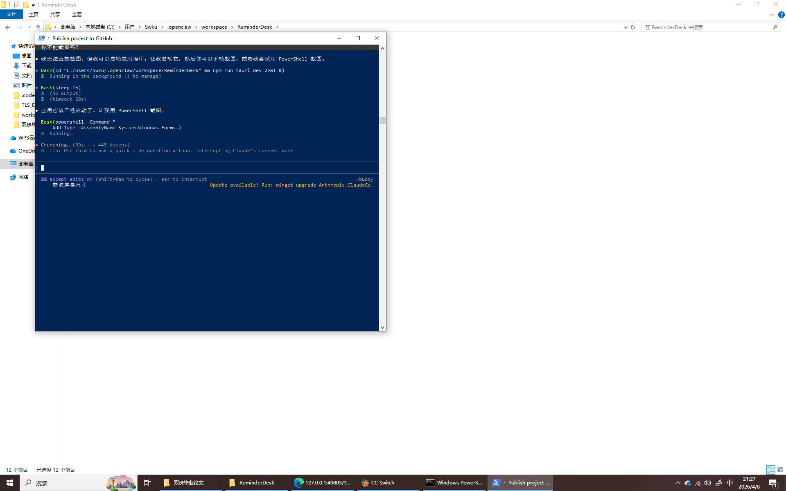

# ReminderDesk - 任务提醒助手

一款基于 Tauri + Svelte 5 构建的桌面任务提醒应用，专为高效任务管理而设计。



## 功能特性

### 任务管理
- **任务创建**：快速添加任务，支持标题、描述、完成时间设置
- **优先级管理**：四级优先级（低、中、高、紧急），一目了然
- **分类管理**：自定义任务分类，支持颜色标识
- **状态筛选**：全部/待办/已完成状态切换
- **分页显示**：支持多种分页尺寸（10/15/20/30/50）

### 提醒功能
- **内置提醒函数**：25种预设提醒时间
  - 提前提醒：5分钟 ~ 1周
  - 当天提醒：早上7点 ~ 晚上20点
  - 隔天提醒：第二天早上8/9点
- **自定义公式**：灵活的时间表达式
  - `DueTime-1h` - 完成时间前1小时
  - `Date+9h` - 当天早上9点
  - `Tomorrow+8h` - 次日早上8点

### 数据管理
- **数据导出**：导出为 JSON 格式，便于备份
- **数据导入**：支持文件导入或粘贴导入，可选合并模式
- **本地存储**：SQLite 数据库，数据安全可靠

### 界面特性
- **现代 UI**：渐变紫色主题，简洁美观
- **系统托盘**：最小化到托盘，不影响工作
- **窗口记忆**：自动保存窗口尺寸和位置

## 技术栈

| 技术 | 说明 |
|------|------|
| Tauri 2.0 | Rust 后端，轻量高效 |
| Svelte 5 | 响应式前端框架 |
| SQLite | 本地数据存储 |
| Vite | 构建工具 |

## 安装

### 从发布包安装
下载最新的 `.exe` 安装包，双击安装即可。

### 从源码构建

```bash
# 克隆仓库
git clone https://github.com/yingsw/ReminderDesk.git
cd ReminderDesk

# 安装依赖
npm install

# 开发模式
npm run tauri dev

# 构建发布
npm run tauri build
```

## 使用说明

### 添加任务
1. 输入任务标题（必填）
2. 填写任务描述（可选）
3. 选择优先级和分类
4. 设置完成日期和时间
5. 选择提醒方式（内置函数或自定义公式）
6. 点击"添加任务"

### 自定义公式语法

| 表达式 | 说明 |
|--------|------|
| `DueTime-1h` | 完成时间前1小时 |
| `DueTime-30m` | 完成时间前30分钟 |
| `DueTime-1d` | 完成时间前1天 |
| `DueTime+1h` | 完成时间后1小时 |
| `Date+9h` | 当天早上9点 |
| `Date+18h` | 当天傍晚18点 |
| `Tomorrow+8h` | 次日早上8点 |

单位说明：`m` = 分钟，`h` = 小时，`d` = 天

## 项目结构

```
ReminderDesk/
├── src/                  # Svelte 前端源码
│   └── App.svelte        # 主应用组件
├── src-tauri/            # Tauri Rust 后端
│   ├── src/
│   │   ├── main.rs       # 入口文件
│   │   ├── database.rs   # 数据库操作
│   │   ├── reminder.rs   # 任务管理
│   │   ├── scheduler.rs  # 定时器
│   │   ├── settings.rs   # 设置管理
│   │   └── tray.rs       # 系统托盘
│   └── tauri.conf.json   # Tauri 配置
├── package.json          # Node 依赖
└── vite.config.js        # Vite 配置
```

## 开发信息

- **开发商**：浙江巨鼎包装有限公司
- **开发者**：应圣卫
- **版本**：0.1.0

## 许可证

本项目采用 MIT 许可证，详见 [LICENSE](LICENSE) 文件。